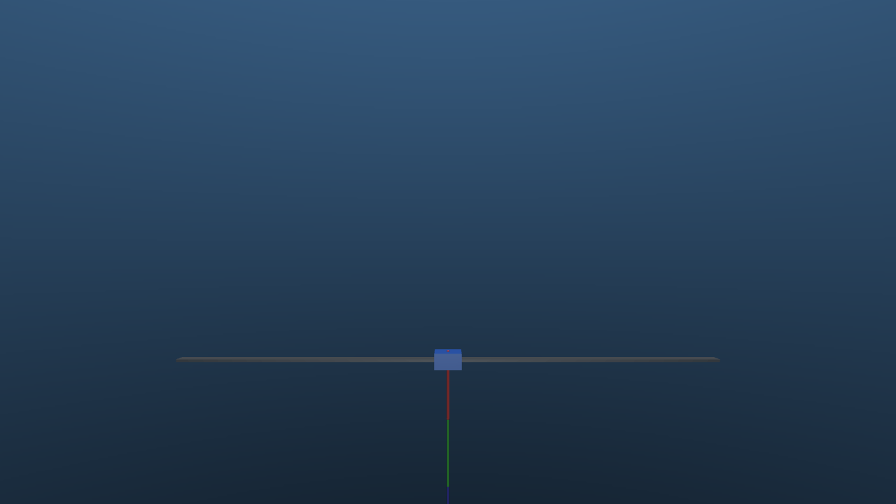
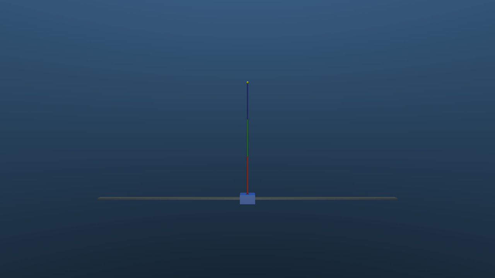
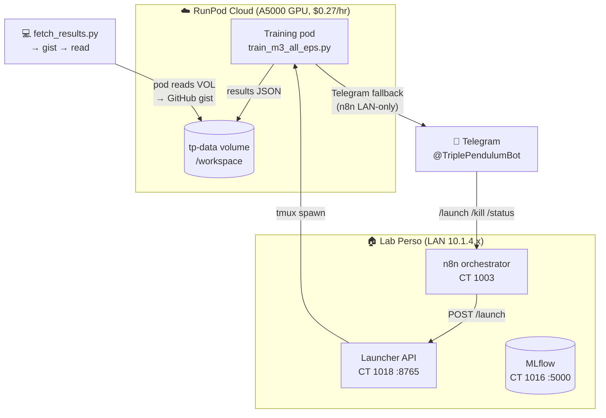
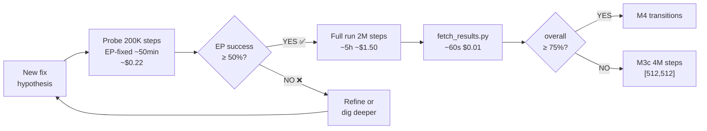

# Triple Inverted Pendulum, Sim2Real RL

[](https://github.com/fawraw/triple-pendulum-sim2real/actions/workflows/ci.yml)
[](LICENSE)
[](https://www.python.org/)
[](https://mujoco.org/)
[](https://github.com/fawraw/triple-pendulum-sim2real/wiki)

**Goal:** First demonstration of all 56 equilibrium transitions of a physical triple inverted pendulum on a cart, controlled by a sim-to-real reinforcement-learning policy, without precomputed trajectories or system-specific feedforward controllers.

| Bottom equilibrium (DDD) | Top equilibrium (UUU) |
|:---:|:---:|
|  |  |

## Why this matters

A triple inverted pendulum on a cart has 8 equilibrium configurations (each link Up or Down: 2³). Moving between any two of them — 8 × 7 = **56 transitions** — is the most general control benchmark for this system.

| Author | System | Method | Sim2Real | Equilibria covered |
|---|---|---|---|---|
| Graichen et al. (Automatica 2013) | Triple cart-pole | LQR + 56 precomputed trajectories | n/a | 8 EPs, 56 transitions |
| Baek et al. (EAAI 2024) | Triple cart-pole | Model-free RL on hardware | ❌ trained on hw | 1 (swing-up to top) |
| Cambridge (Robotica 2026) | Underactuated triple | SAC + curriculum | ✅ | 1 (balance at top) |
| MDPI Machines (2025) | Double cart-pole | Sim2Real RL | ✅ | 4 EPs, 12 transitions |
| **This project** | **Triple cart-pole** | **Sim2Real RL (TQC)** | **✅** | **8 EPs, 56 transitions** |

The intersection (triple pendulum, Sim2Real RL, all 56 transitions) has never been demonstrated in the literature as of May 2026.

## Quickstart

```bash
git clone https://github.com/fawraw/triple-pendulum-sim2real.git
cd triple-pendulum-sim2real
./scripts/setup_env.sh                # creates .venv with MuJoCo, Gymnasium, SB3, TQC
source .venv/bin/activate

# Sanity check the environment
MUJOCO_GL=osmesa python -m sim.envs.triple_pendulum_env

# Run unit tests
pytest

# Train milestone 2 (stabilize UUU). Logs to ./mlruns by default.
MUJOCO_GL=osmesa python -m training.train_m2_upright \
    --config training/configs/m2_upright_tqc.yaml

# Render a deterministic rollout of a trained policy
MUJOCO_GL=osmesa python scripts/render_rollout.py \
    --policy checkpoints/<run_name>/final.zip --ep 7 --out rollout.mp4
```

To log experiments to a remote MLflow server: `export MLFLOW_TRACKING_URI=...`.

For training pipeline details, n8n orchestration, and configs, see the [project wiki](https://github.com/fawraw/triple-pendulum-sim2real/wiki).

## Pipeline architecture

Training stages run unattended. n8n decides advance / retry / escalate. Cloud pods (RunPod) can't reach the LAN n8n, so they fall back to Telegram directly.



### Probe → validate → full run



| Stage | Pass criterion | On pass | On fail |
|---|---|---|---|
| M2 | `ep7_success_rate ≥ 0.80` | M3b | HUMAN_REVIEW |
| M3b | `overall_success_rate ≥ 0.75` | M4 | M3c |
| M3c | `overall_success_rate ≥ 0.75` | M4 | HUMAN_REVIEW |
| M4 | `overall_success_rate ≥ 0.80` (56 transitions) | M5 | HUMAN_REVIEW |

See [n8n-Orchestration](https://github.com/fawraw/triple-pendulum-sim2real/wiki/n8n-Orchestration) and [Training-Pipeline](https://github.com/fawraw/triple-pendulum-sim2real/wiki/Training-Pipeline) for the full config.

## Status

| Milestone | Status | Date |
|---|---|---|
| 0. Literature gap confirmed | ✅ | 2026-05-08 |
| 1. MuJoCo model, 3 links on cart | ✅ | 2026-05-08 |
| 2. Stabilize UUU in sim (TQC) | 🟡 partial | 2026-05-08 |
| 3. All 8 EPs stabilized in sim | 🟢 **M3b-v6 cloud: 72.5%, all 8 EPs non-zero** (EP4=30%, EP6=40%) — scientific milestone achieved. 75% threshold ~2.5% away; v6-phase3 and v7 consolidation runs in flight. | 2026-05-13 |
| 4. 56 transitions in sim | ⬜ scaffolded | |
| 5. Domain randomization | ⬜ | |
| 6. Hardware v1 assembled | ⬜ | |
| 7. First Sim2Real swing-up | ⬜ | |
| 8. All 56 transitions on hardware | ⬜ | |
| 9. arXiv preprint | ⬜ | |
| 10. Conference submission | ⬜ | |

### Latest results

**🎯 M3b-v6 cloud (2026-05-13): 72.5% overall, all 8 EPs non-zero** — first time in 10+ random-mode runs that EP4 and EP6 both produce successful rollouts.

| EP | Config | Best baseline (M3c, 67.5%) | **M3b-v6 cloud [512,512]** | Delta |
|:--:|:------:|---:|---:|---:|
| 0 | DDD | ~ | **100%** | = |
| 1 | DDU | ~ | **100%** | = |
| 2 | DUD | 100% | **100%** | = |
| 3 | DUU | 90% | **90%** | = |
| **4** | **DDU** | **0%** | **30%** | **▲▲▲** |
| 5 | UDU | 80% | **80%** | = |
| **6** | **DUU** | **0%** | **40%** | **▲▲▲** |
| 7 | UUU | 80% | **40%** | ▼ |
| **Overall** | | **67.5%** | **72.5%** | **▲ +5%** |

> **What worked:** warm-start from the existing 67.5% [512,512] checkpoint (M3c), then 2-phase targeted fine-tuning — phase 1 with `hard_ep_weight=20` (~46% exposure each on EP4/EP6) at LR=1e-4 for 600K steps, then phase 2 consolidation with `hard_ep_weight=2.5` at LR=5e-5 for 500K steps.  Bigger network ([512,512]) was critical: the [256,256] variant (CT 1018) hit catastrophic forgetting and dropped EP7 to 0%.
>
> **Diagnostic (2026-05-12) drove the v6 design.** Before v6 we ran a full RL diagnostic:
> - **LQR control** (numerically linearized + Riccati): stabilizes EP4 and EP6 at 1000/1000 steps with action max ±0.21.  Physics is fine, motor over-spec, env correctly configured.  EP4 has only 1 unstable mode (easier than EP7's 3).
> - **Policy vs zero-action on EP4**: trained TQC survives only 184 steps before fall — WORSE than zero-action's 387.  Bang-bang ±1 actions cancel out (cart barely moves ±0.15m) but shake the chain → fall.  Pure exposure problem (12.5% random-mode insufficient).
> - **Wiki re-labeling**: EP4 = DDU (tip-up only), not UDD as documented.  EP6 = DUU.  Bit 2 (MSB) = link 3 (tip).

### M3 debugging journey

```
Run                    Net          Steps    Overall  EP4   EP6   Notes
──────────────────────────────────────────────────────────────────────────────
M3 baseline            [256,256]    400K     42.5%    0%    0%    First attempt
M3b CPU                [256,256]    2M       67.5%    0%    0%    More steps, same plateau
M3b GPU                [256,256]    2M       68.0%    0%    0%    GPU (8×faster), same
M3b-v2                 [256,256]    2M       61.3%    0%    0%    Per-link fix + eval bug
Probe EP4-fixed        [256,256]    200K     n/a      60%   n/a   Pure EP4 training works!
M3b-v3 (adaptive)      [256,256]    2M       60%      0%    0%    EP2 regression
M3b-v4 A/B/C/E         [256,256]    2M       50-52%   0%    0-10% Oversample variants, all failed
M3b-v4D (M3c [512²])   [512,512]    4M       67.5%    0%    0%    Capacity not the bottleneck
M3b-v6 CT 1018         [256,256]    1.1M     56%      0%    30%   Catastrophic forgetting on EP7
🎯 M3b-v6 CLOUD        [512,512]    1.1M     72.5%    30%   40%   ← BREAKTHROUGH, all 8 EPs > 0
M3b-v6 phase 3         [512,512]    300K     TBD                  Consolidate from 72.5%
M3b-v7 (weight=10)     [512,512]    1.1M     TBD                  Less-aggressive variant
```

**Cumulative training cost on RunPod:** ~$18 USD total (all M3 experiments, including diagnostic + v6 + v7). CT 1018 free.

*Note on link numbering:* `target_ep` is a 3-bit integer where bit 2 (MSB) = link 3 (tip), bit 1 = link 2 (mid), bit 0 = link 1 (base/cart-attached).  A 1 means UP.  So `target_ep=4` = 0b100 = DDU (tip-up only).  Earlier wiki edits had the bit order reversed — corrected 2026-05-12.

## Tech stack

| Layer | Tool |
|---|---|
| Simulation | MuJoCo 3.x + Gymnasium |
| RL algorithm | TQC (Truncated Quantile Critics) via sb3-contrib |
| Backend | PyTorch 2.4 (CPU on CT 1018, CUDA 12.4 on RunPod cloud) |
| Parallel envs | `SubprocVecEnv` with picklable thunks, n_envs=8 default |
| Experiment tracking | MLflow (self-hosted on CT 1016) |
| Pipeline orchestration | n8n (self-hosted on CT 1003) |
| Cloud GPU | RunPod (RTX A5000, $0.27/hr, network volume `tp-data` 50 GB) |
| Bot interface | Telegram `@TriplePendulumBot` (n8n polling, 11 commands) |
| Real-time control | ZeroMQ between policy PC and STM32 1 kHz loop (planned, M6+) |
| Monitoring | Grafana + InfluxDB (planned) |

## Infrastructure

```
┌────────────┐    n8n webhook     ┌──────────────┐
│ RunPod pod │  ─────────────►    │   n8n        │
│ A5000 GPU  │                    │  CT 1003     │ ──► Telegram bot
└────────────┘                    │              │     @TriplePendulumBot
       │ logs                     └──────────────┘
       ▼
┌────────────┐                    ┌──────────────┐
│ tp-data    │                    │   MLflow     │
│ network    │                    │  CT 1016     │
│ volume     │                    │              │
└────────────┘                    └──────────────┘
       ▲
       │  /workspace
┌────────────┐
│ CT 1018    │  pipeline_notifier ► n8n webhook ► launch next stage
│ launcher   │  (HTTP :8765)
└────────────┘
```

- **Local CPU training**: CT 1018 runs the launcher API; n8n triggers stages via the launcher when previous stage finishes.
- **Cloud GPU training**: RunPod pods clone the repo at boot, run training, push results via webhook. Network volume persists `mlruns/` and `results/` across pods.
- **Telegram bot**: `/status`, `/runpod`, `/launch m3b|m3c|m4`, `/kill`, `/cost`, `/pod_start`, `/pod_stop confirm` — see [n8n/triple_pendulum_bot.json](n8n/triple_pendulum_bot.json).
- **Operational doc**: [docs/runbook.md](docs/runbook.md) covers DNS-not-ready, MLflow zombies, secret rotation, cost guards.

## Cloud training (RunPod)

```bash
# Pre-requisite: RunPod account + network volume "tp-data" + template "tp-train"
# (see runpod/README.md for full setup)

# Launch via REST API (or use Telegram bot /launch m3b)
curl -X POST "https://rest.runpod.io/v1/pods" \
    -H "Authorization: Bearer $RUNPOD_API_KEY" \
    -H "Content-Type: application/json" \
    -d '{
      "name": "tp-m3b",
      "templateId": "<tp-train template id>",
      "gpuTypeIds": ["NVIDIA RTX A5000"],
      "gpuCount": 1,
      "networkVolumeId": "<tp-data id>",
      "env": {
        "TP_AUTO_SHUTDOWN": "1",
        "TP_STAGE_MODULE": "training.train_m3_all_eps",
        "TP_STAGE_CONFIG": "training/configs/m3b_all_eps_tqc.yaml",
        "TELEGRAM_FALLBACK_BOT_TOKEN": "<your bot token>",
        "TELEGRAM_FALLBACK_CHAT_ID": "<your chat id>"
      }
    }'
```

The pod runs [`scripts/runpod_bootstrap.sh`](scripts/runpod_bootstrap.sh) which:
1. Waits for DNS, installs OS deps if absent.
2. Clones the repo at the latest `main` (or `TP_REPO_REF` if pinned).
3. Pre-installs `blinker` via pip to bypass the apt-distutils conflict.
4. Installs `requirements.txt` (keeps the image's torch 2.4.1+cu124 to match the host driver).
5. Spawns an idle watchdog (force-stops the pod after 30 min of GPU<5% — cost guard).
6. Runs the training stage. On completion, posts results JSON to n8n (with Telegram fallback if the LAN n8n is unreachable from cloud).
7. Auto-shuts down via the RunPod GraphQL API.

**Typical cost:** $0.27–0.40 per stage on A5000 ($0.30 for M3b 2M steps, $0.50–0.80 for M3c 4M).

## Repository layout

```
sim/
  envs/                Gymnasium environments
  models/              MuJoCo XML files
training/
  configs/             TQC hyperparameters per milestone (m2, m3b, m3c, m4)
  train_m{2,3,4}_*.py  Training entrypoints
  pipeline_notifier.py POSTs to n8n + writes results JSON
  pipeline_stages.json Stage transitions (read by n8n)
scripts/
  launcher_api.py         HTTP launcher API for n8n to start training (:8765)
  runpod_bootstrap.sh     Cloud pod boot script (DNS wait, pip fix, idle watchdog)
  report_to_telegram.py   Exfil results from cloud pods via Telegram (SSH fallback)
  tp_status.sh            All-in-one pipeline status (launcher + MLflow + results)
  render_rollout.py       Render saved policy to MP4
  eval_policy.py          Per-EP evaluation
runpod/
  Dockerfile              CUDA image definition (PyTorch 2.4+MuJoCo+osmesa)
  README.md               Operator setup guide, GPU types, cost table, gotchas
n8n/
  triple_pendulum_pipeline.json  Orchestration workflow (importable)
  triple_pendulum_bot.json       Telegram bot (11 commands, polling-based)
hardware/
  bom/                    Bill of materials (planned for M6)
docs/
  roadmap.md              Mirror of the wiki Roadmap (canonical: wiki)
  runbook.md              Operational troubleshooting (8 failure scenarios)
  launcher_api.service    Systemd unit template (KillMode=process)
  literature/             Annotated bibliography
tests/                    pytest unit tests (env, notifier, stages, launcher, m4)
results/                  Per-run JSON snapshots from pipeline_notifier (committed)
CHANGELOG.md              Dated changelog
.githooks/
  pre-commit              Secret-pattern scanner, chains to global Lab Perso hook
assets/                   Figures and demo media
```

## Reproducibility

- Every training run is logged to MLflow with code commit hash, seed, full config, learning curves, and final eval metrics.
- MuJoCo XML files are versioned alongside training scripts.
- Pipeline state JSON files in `results/` are committed for permanent record (without secrets — see [`pipeline_notifier.py`](training/pipeline_notifier.py)).
- Hardware BOM, firmware, CAD will be released with the paper.

## Citation (placeholder)

```bibtex
@misc{said2026triplependulum,
  author = {Saïd, Farid},
  title  = {Sim-to-Real Reinforcement Learning for All 56 Equilibrium Transitions of a Triple Inverted Pendulum},
  year   = {2026},
  url    = {https://github.com/fawraw/triple-pendulum-sim2real}
}
```

## License

- **Code, configs, scripts:** [MIT](LICENSE) — current scope of this repo.
- **Hardware (BOM, CAD, firmware):** CERN-OHL-W v2 — will be added under `hardware/` and a `LICENSE-HARDWARE` file when M6 ships.
- **Docs (`docs/`, wiki):** CC-BY 4.0 — will be added under `LICENSE-DOCS` when the paper is released.
