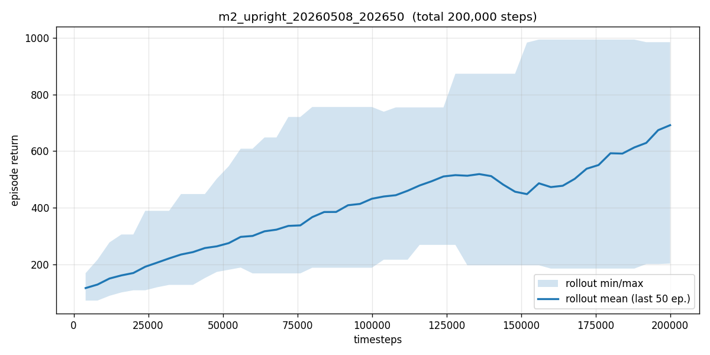

# Triple Inverted Pendulum, Sim2Real RL

[](https://github.com/fawraw/triple-pendulum-sim2real/actions/workflows/ci.yml)
[](#license)
[](https://www.python.org/)
[](https://mujoco.org/)
[](https://github.com/fawraw/triple-pendulum-sim2real/wiki)

**Goal:** First demonstration of all 56 equilibrium transitions of a physical triple inverted pendulum on a cart, controlled by a sim-to-real reinforcement-learning policy, without precomputed trajectories or system-specific feedforward controllers.

| Bottom equilibrium (DDD) | Top equilibrium (UUU) |
|:---:|:---:|
|  |  |

## Why this matters

A triple inverted pendulum on a cart has 8 equilibrium configurations (each link Up or Down: 2³). Moving between any two of them — 8 × 7 = **56 transitions** — is the most general control benchmark for this system.

| Author | System | Method | Sim2Real | Equilibria covered |
|---|---|---|---|---|
| Graichen et al. (Automatica 2013) | Triple cart-pole | LQR + 56 precomputed trajectories | n/a | 8 EPs, 56 transitions |
| Baek et al. (EAAI 2024) | Triple cart-pole | Model-free RL on hardware | ❌ trained on hw | 1 (swing-up to top) |
| Cambridge (Robotica 2026) | Underactuated triple | SAC + curriculum | ✅ | 1 (balance at top) |
| MDPI Machines (2025) | Double cart-pole | Sim2Real RL | ✅ | 4 EPs, 12 transitions |
| **This project** | **Triple cart-pole** | **Sim2Real RL (TQC)** | **✅** | **8 EPs, 56 transitions** |

The intersection (triple pendulum, Sim2Real RL, all 56 transitions) has never been demonstrated in the literature as of May 2026.

## Quickstart

```bash
git clone https://github.com/fawraw/triple-pendulum-sim2real.git
cd triple-pendulum-sim2real
./scripts/setup_env.sh                # creates .venv with MuJoCo, Gymnasium, SB3, TQC
source .venv/bin/activate

# Sanity check the environment
MUJOCO_GL=osmesa python -m sim.envs.triple_pendulum_env

# Run unit tests
pytest

# Train milestone 2 (stabilize UUU). Logs to ./mlruns by default.
MUJOCO_GL=osmesa python -m training.train_m2_upright \
    --config training/configs/m2_upright_tqc.yaml

# Render a deterministic rollout of a trained policy
MUJOCO_GL=osmesa python scripts/render_rollout.py \
    --policy checkpoints/<run_name>/final.zip --ep 7 --out rollout.mp4
```

To log experiments to a remote MLflow server: `export MLFLOW_TRACKING_URI=...`.

For training pipeline details, n8n orchestration, and configs, see the [project wiki](https://github.com/fawraw/triple-pendulum-sim2real/wiki).

## Pipeline architecture

The training stages run unattended on a dedicated host. n8n decides what to do after each stage finishes — advance to the next, retry, or escalate.

```mermaid
flowchart LR
    A[Training script<br/>train_m{2,3,4}*.py] -->|writes results.json| B[pipeline_notifier.py]
    B -->|POST webhook| C{n8n<br/>orchestrator}
    C -->|metric ≥ threshold| D[Launcher API<br/>:8765/launch]
    C -->|metric &lt; threshold| E[Launcher API<br/>fallback config]
    C -->|HUMAN_REVIEW| F[Telegram alert]
    D -->|tmux new-session| A
    E -->|tmux new-session| A
    A -.->|metrics| G[(MLflow<br/>10.1.4.230)]
```

| Stage | Pass criterion | On pass | On fail |
|---|---|---|---|
| M2 | `ep7_success_rate ≥ 0.80` | M3b | HUMAN_REVIEW |
| M3b | `overall_success_rate ≥ 0.75` | M4 | M3c |
| M3c | `overall_success_rate ≥ 0.75` | M4 | HUMAN_REVIEW |
| M4 | `overall_success_rate ≥ 0.80` (over 56 transitions) | HUMAN_REVIEW (M5) | HUMAN_REVIEW |

See [n8n-Orchestration](https://github.com/fawraw/triple-pendulum-sim2real/wiki/n8n-Orchestration) and [Training-Pipeline](https://github.com/fawraw/triple-pendulum-sim2real/wiki/Training-Pipeline) for the full configuration.

## Status

| Milestone | Status | Date |
|---|---|---|
| 0. Literature gap confirmed | ✅ | 2026-05-08 |
| 1. MuJoCo model, 3 links on cart | ✅ | 2026-05-08 |
| 2. Stabilize UUU in sim (TQC) | 🟡 partial | 2026-05-08 |
| 3. All 8 EPs stabilized in sim | 🟡 M3b training (2M steps) | 2026-05-09 |
| 4. 56 transitions in sim | ⬜ scaffolded | |
| 5. Domain randomization | ⬜ | |
| 6. Hardware v1 assembled | ⬜ | |
| 7. First Sim2Real swing-up | ⬜ | |
| 8. All 56 transitions on hardware | ⬜ | |
| 9. arXiv preprint | ⬜ | |
| 10. Conference submission | ⬜ | |

### Latest results

**M2 (UUU, 150K steps, [128,128]):** mean episode length 824/1000 over 20 deterministic eval rollouts, peak 1000. Acceptance threshold not yet met but pipeline validated end-to-end.



**M3 baseline (400K steps, [256,256], target resampled uniformly):**

| EP | Config | Success rate |
|:--:|:------:|:------------:|
| 0 | DDD | 100% |
| 1 | DDU | 100% |
| 2 | DUD | 50% |
| 3 | DUU | 80% |
| 4 | UDD | 0–10% |
| 5 | UDU | 0–10% |
| 6 | UUD | 0–10% |
| 7 | UUU | 0–10% |
| **Overall** | | **42.5%** |

EP0/EP1 (gravity-assisted) trivial. EP4–EP7 (≥1 link upright) need more steps or a curriculum. **M3b (2M steps, [256,256], 1M buffer)** is currently training; results posted to the [Results](https://github.com/fawraw/triple-pendulum-sim2real/wiki/Results) wiki page on completion.

## Tech stack

| Layer | Tool |
|---|---|
| Simulation | MuJoCo 3.x + Gymnasium |
| RL algorithm | TQC (Truncated Quantile Critics) via sb3-contrib |
| Backend | PyTorch (CPU sufficient for these network sizes) |
| Experiment tracking | MLflow (self-hosted) |
| Pipeline orchestration | n8n (self-hosted) |
| Real-time control | ZeroMQ between policy PC and STM32 1 kHz loop |
| Monitoring | Grafana + InfluxDB (planned) |

## Repository layout

```
sim/
  envs/                Gymnasium environments
  models/              MuJoCo XML files
training/
  configs/             TQC hyperparameters per milestone (m2, m3b, m3c, m4)
  train_m{2,3,4}_*.py  Training entrypoints
  pipeline_notifier.py POSTs to n8n + writes results JSON
  pipeline_stages.json Stage transitions (read by n8n)
scripts/
  launcher_api.py      HTTP launcher for n8n to start training
  render_rollout.py    Render saved policy to MP4
  eval_policy.py       Per-EP evaluation
  plot_learning_curve.py
n8n/
  triple_pendulum_pipeline.json   Workflow definition (importable)
hardware/
  bom/                 Bill of materials (planned for M6)
docs/
  roadmap.md           Mirror of the wiki Roadmap (canonical: wiki)
  literature/          Annotated bibliography
tests/                 pytest unit tests (env, notifier, stages, launcher)
assets/                Figures and demo media
```

## Reproducibility

- Every training run is logged to MLflow with code commit hash, seed, full config, learning curves, and final eval metrics.
- MuJoCo XML files are versioned alongside training scripts.
- Pipeline state JSON files in `results/` are committed for permanent record (without secrets — see [`pipeline_notifier.py`](training/pipeline_notifier.py)).
- Hardware BOM, firmware, CAD will be released with the paper.

## Citation (placeholder)

```bibtex
@misc{said2026triplependulum,
  author = {Saïd, Farid},
  title  = {Sim-to-Real Reinforcement Learning for All 56 Equilibrium Transitions of a Triple Inverted Pendulum},
  year   = {2026},
  url    = {https://github.com/fawraw/triple-pendulum-sim2real}
}
```

## License

- **Code:** [MIT](LICENSE)
- **Hardware:** CERN-OHL-W v2 (planned, applies once hardware/ is published)
- **Docs:** CC-BY 4.0
